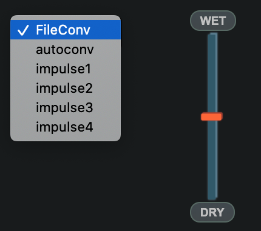
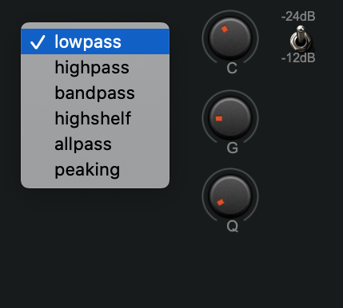
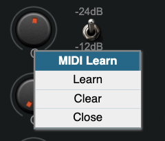
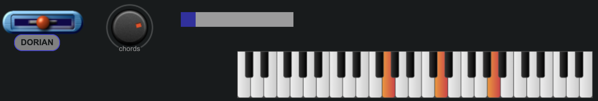
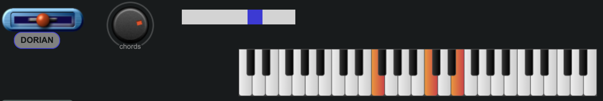

  

[Here](https://www.mediafire.com/file/v2jati117jpb6pt/sounds.rar/file) we uploaded a pack of mp3 sounds, you can use them as main brick. 

## 1.Introduction

The Harmonic File Synthesizer is an app that brings the user nearer to harmony and sound visualizing while displaying many classic characteristics of a synth. 

It's divided in three main modules: the waveform-visualizer; the sound synthesis controls and the padbuilder interface with the user.
The application runs best on Chrome browser because of the use of Tone.js and WebAudio API. 

### 1.1.Tips and issues

It's better to use the application along with a midi controller, since the keyboard component has to be clicked to be enabled.
The pad builder interface can also be used with the computer keyboard and the pc mouse.

When using the app with a midi keyboard:
if some keys keep on being active, just mouse click on some keys of the virtual keyboard. Be sure to refresh the page after connecting the MIDI device.

When using the app with computer keyboard and mouse:
clicking outside the virtual keyboard disactivates computer keyboard, so we advice to keep one single note playing (keeping the pc keyboard down) and use knobs and filters to create a sequence of chords for your voice (if the touch pad is disabled while pressing a key its better to use a mouse).

Chord-modes-filters knobs support MIDILearn, we advice to set MIDILearn on the knobs before starting to play.

## 2.WaveSurfer

  

The first step is to load an mp3 file on the wavesurfer and choose the sample that is going to be played in the pad builder section.

The user finds four blue buttons:
- **play/pause**: start/stop the listening of what's inside the wavesurfer;
- **main waveform**: returns to the original uploaded audio sample waveform  it's mostly used when the region is unsatisfaying and the user needs to go back to choose a new region;
- **cut waveform** : show the chosen region waveform;
- **reverse** : active only after one region has been shown (cut-waveform), it reverses the smallBuffer (region buffer) inside the wavesurfer

The user finds two sliders:

- **zoom** : used to raise or diminish zoom in order to choose a region
- **smoother** : used to prevent the click that could come from the sample cut of the user. We recommend to use low values of smoothing for a more continuous sound. The smoothing works with an exponential function that softens both edges.

Sample before smoothing:

Sample after smoothing: 

## 3.Controls

From now on the signal has been chosen and we start the signal-processing part of the app. 

### 3.1.Convolver

The convolution section is divided in two major components : 
**the convolution type dropdown**
The chosen signal (put into a small Buffer) is sent to a Tone.Convolver where it is convolved with an audio signal (impulse). 
There is a **dropdown-select** that defines the impulse provenance: FileConv for external file impulse, autoconv for autoconvolution and impulse 1--4 for preset impulses;

**the file input for user defined impulses**
The user defines the file that he wants to use for convolution by clicking on the **impulse file input**, right down the dropdown select;

**the dry/wet slider**
The control of the gain of the processed signal is done by the **dry/wet slider**, (dry = unprocessed signal || wet = processed signal).
When the slider is at zero (down) the signal is 100%dry and 0%wet, when the slider is at its maximum value (up) the signal is 0%dry and 100%wet;

### 3.2.Filter

The filter section is divided in two major components : 
**the filter type dropdown**
After being convolved, the signal is sent to a Tone.Filter that changes its spectral content. There is a **dropdown-select** that defines the type of the filter, each type involves a certain number of control knobs;

[ lowpass (gain disabled), highpass (gain disabled), bandpass (gain disabled), highshelf (q disabled), allpass (gain disabled), peaking (uses all) ]

**the filter controllers**
Three webAudioComponents knobs controlling **Cut,Gain,Q** and a switch for the slope of the filter **-12dB/-24dB**; the Cut, Gain and Q knobs can be connected via **MIDI Learn by right-clicking on them , pressing learn and moving a knob on the midi device**.

### 3.3.ADSR

The envelope of the played sound is controlled by a Tone.envelope; it's applied each time a key of the keyboard interface is pressed (see chapter 4). The user can set attack, decay, sustain and release values using the **four relative faders ADSR**. 
The set envelope is visualized in a canvas.  

## 4.PadBuilder
This is the part relative to the playing of the sound (user interface) and the harmonization of the signal.

### 4.1.Keyboard Interface
**webAudioComponents keyboard**
It can be played in three ways:
1) using a **MIDI device**
2) using the **pc keyboard** --->the subsequence of semitones follows the keyboard letters from the "Z" to the "P" and then from "1" to "0"
3) clicking on the keyboard.

Since the mouse should be busy changing the controls the best way to play is the first.
The keyboard allows multi-touch, but is a **mono keyboard** (only one note at a time will be playing even if pressing more notes). When clicking on the keyboard it's better to not slide between keys.

### 4.2.Harmonizer : Modes , Chords, Variations

The HFS is provided with an innovative set of harmonizing techniques based on the most ancient five modes (greek modes + locrian). When a key is pressed we can harmonize it by changing the value of the Pad Builder controls.

**Pad Builder Controls**
The **Modes** are selected by a webaudio knob , each Mode has a set of 4 **Chords** controlled by another webaudio-knob (all webaudio-knobs allow **MIDI Learn**) and a set of 3 **Variations** controlled by a slider.

Modes : phrygian -- mixolydian -- dorian -- lydian -- locrian

The **Chords** knob has five values [0,1,2,3,4], when its to 0 there is no chord set, when the value goes from 1 to 4 it forms four different chords using the pitch of the played note as tonic.

 

 G key played 

The **Variations** slider has four values [0,1,2,3], its preset value is 0 and each time it is released it returns to 0. When its value goes from 1 to 3 it forms three different chords using as tonic a different pitch from the played one.

 G key played 

Each chord can be directly visualised on the keyboard, allowing people to learn chords and modes directly playing into the app.

### 4.3.Master Volume

The last but not least component is the **Master Volume slider**, which sets the Master volume in dB. It's very useful to set the right volume to prevent clicking and disturbed signals when their amplitude is too high. It is also useful to make the sound hearable (for example applying a bandpass -24dB filter cuts the amplitude of the processed sound).

We advise so wisely use the Master Slider while playing and processing the signal.

