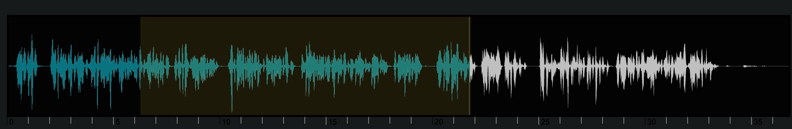
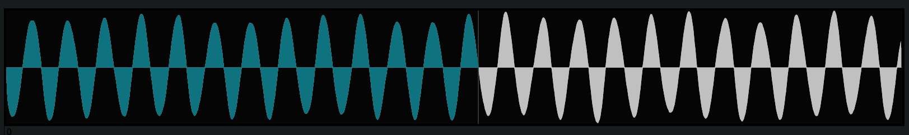
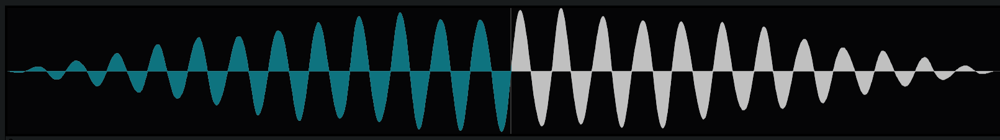

  

[Here](https://www.mediafire.com/file/v2jati117jpb6pt/sounds.rar/file) we uploaded a pack of mp3 sounds, you can use them as main brick. 

## Introduction

The Harmonic File Synthesizer is an app that brings the user nearer to harmony and sound visualizing while displaying many classic characteristics of a synth. 

It's divided in three main modules: the waveform-visualizer; the sound synthesis controls and the padbuilder interface with the user.
The application runs best on Chrome browser because of the use of Tone.js and WebAudio API. 

### Tips and issues

It's better to use the application along with a midi controller, since the keyboard component has to be clicked to be enabled.
The pad builder interface can also be used with the computer keyboard and the pc mouse.

When using the app with a midi keyboard:
if some keys keep on being active, just mouse click on some keys of the virtual keyboard.

When using the app with computer keyboard and mouse:
cliking outside the virtual keyboard disactivates computer keyboard, so we advice to keep one single note playing and use knobs and filters to create a sequence of chords for your voice.

Chord-modes-filters knobs support midilearn, we advice to set midilearn on the knobs before starting to play.

## WaveSurfer

  

The first step is to load an mp3 file on the wavesurfer and choose the sample that is going to be played in the pad builder section.

The user finds four blue buttons:
- play/pause: start/stop the listening of what's inside the wavesurfer;
- main waveform: returns to the original uploaded audio sample waveform  it's mostly used when the region is unsatisfaying and the user needs to go back to choose a new region;
- cut waveform : show the chosen region waveform;
- reverse : active only after one region has been shown (cut-waveform), it reverses the smallBuffer (region buffer) inside the wavesurfer

The user finds two sliders:

- zoom : used to raise or diminish zoom in order to choose a region
- smoother : used to prevent the click that could come from the sample cut of the user. We recommend to use low values of smoothing for a more continuous sound. The smoothing works with an exponential function that softens both edges.

sample before smoothing:

sample after smoothing: 

